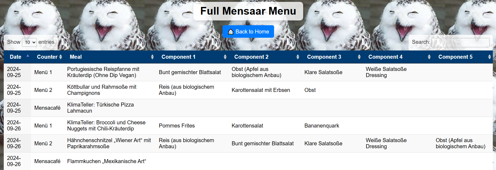
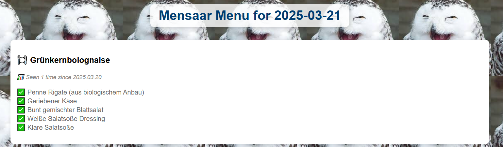

# 🍽 🥨 MensaarLecker -- A beloved tool to find out Mensa Ladies' favourite menu 🥨 🍽

As an [UdS](https://www.uni-saarland.de/start.html) Student, 
Are you tired of seeing french fries🍟 3 times a week, or wondering when I can have the best pizza 🍕 in the Mensacafe?
MensaarLecker aims to collect all the data from Menu 1, 2, and Mensacafe to trace your favourite, or Mensa Ladies', favourite menu!

---

## 🥗 Description

A fully automated scraper and static website for the Saarbrücken Mensa, powered by Python, Selenium, Google Sheets, and GitHub Actions.

> Get a clean and daily-updated overview of meals from [mensaar.de](https://mensaar.de), with searchable history, meal components, and frequency stats.

---

## 🌐 Live Demo

👉 [View Website](https://your-username.github.io/MensaarLecker)  
👉 [View Data in Google Sheets](https://docs.google.com/spreadsheets/d/your-sheet-id-here)



---

## 📅 Features

- ✅ Scrapes the Saarbrücken Mensa daily menu
- ✅ Publishes structured data to a connected Google Sheet
- ✅ Generates static HTML pages:
  - **`index.html`** – Today’s menu with meal frequency counts
  - **`menu.html`** – Full searchable menu with DataTables
- ✅ Automatically updates via GitHub Actions at **10:00 AM UTC on weekdays**
- ✅ Beautiful card-style layout & component display
- ✅ No server required — 100% static

---

## 🧠 Meal Frequency Display Example

The homepage shows how often each meal has been served based on historical data since 2025.03.20:

**🍽️ Pasta mit Tomatensoße**

*📊 Seen since 2025.03.20*

✅ Geriebener Käse

✅ Rucola



---

## 📁 Project Structure

```bash
.
├── Mensaar_scraper.py         # Scrapes from mensaar.de and writes to Google Sheet
├── generate_menu.py           # Reads the sheet and generates index.html and menu.html
├── credentials.json           # Google service account key (excluded from repo)
├── index.html                 # Main website page with today's menu
├── menu.html                  # Full searchable table of meals
├── .github/workflows/
│   └── update_menu.yml        # GitHub Actions automation
├── src/
│   └── uds_spirit.jpg         # Soul of this project
└── README.md

